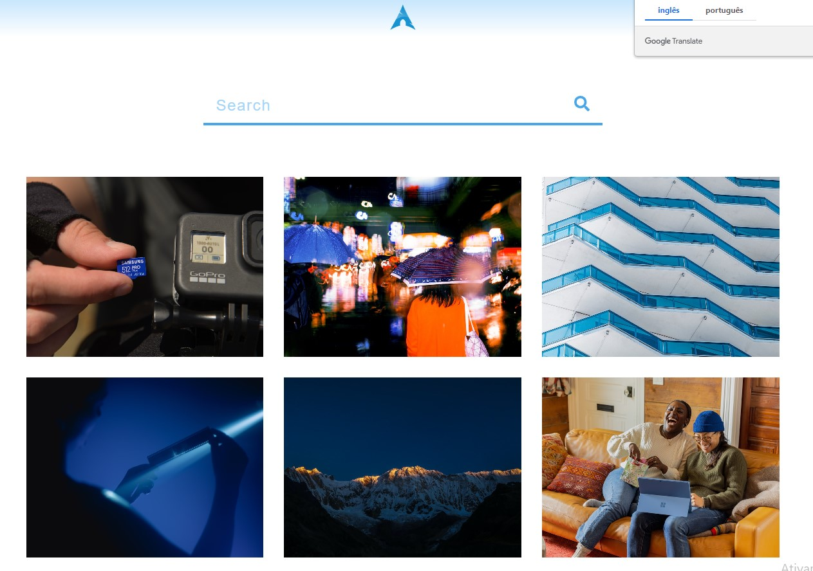

## Stock Photos !  🎞️ 📸

 

## Uma aplicação que utiliza fotos através do serviço da ( Unsplash ), com o scroll "infinito".

## Projeto 🥰 💻 📚

### [Stock Photos](https://react-js-stock-photos.netlify.app/) 🔗

## Tecnologias que utilizei para o projeto ;  

 
    
    
    
    

## O código foi desenvolvido usando os Hooks ;
- useState ; 
- useEffect ; 
- useRef ;
## A estilização foi feita com a biblioteca ;
- Styled Components. 💻 📚
## 🎲 Rodando o Back End (servidor)
- npm install
- npm start

